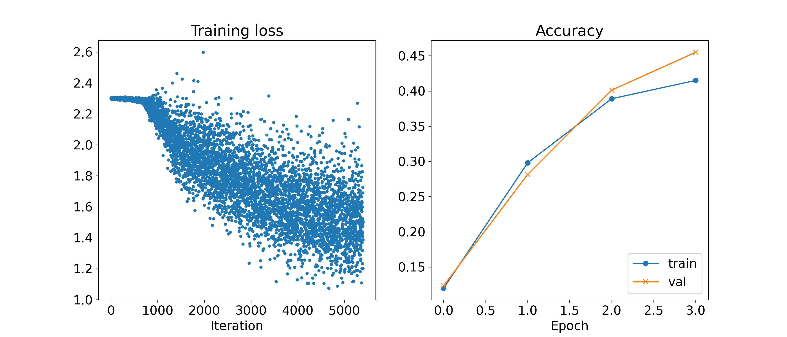
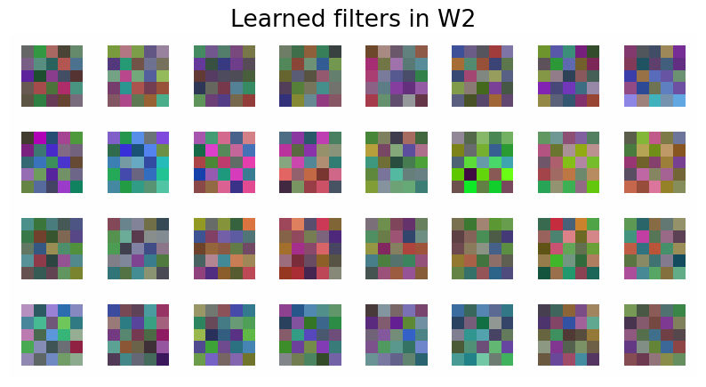
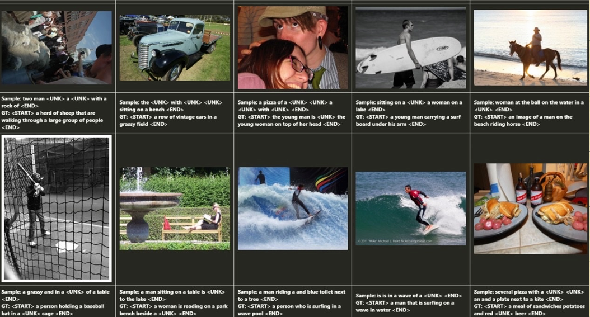

# 🧠 CNN & RNN from Scratch in NumPy

This project implements both **Convolutional Neural Networks (CNNs)** for image classification and **Recurrent Neural Networks (RNNs)** for sequence generation, built entirely from scratch using **NumPy**. No external ML libraries like PyTorch or TensorFlow are used. This is an educational codebase to deeply understand the mechanics of deep learning at the matrix level.

---

## 🧩 Models Implemented

### 🔹 1. CNN for Image Classification

Implemented in: `cnn.py`, `cnn_layers.py`, `layers.py`

### 🧠 CNN: Training Loss & Accuracy

This figure shows the CNN model’s learning progress. The **left** plot illustrates how the training loss decreases over iterations, and the **right** plot shows training and validation accuracy across epochs.



- The training loss steadily decreases, indicating effective optimization.
- Validation accuracy closely follows training accuracy, showing minimal overfitting.

---

### 🧠 CNN: Learned Convolutional Filters

Below are the convolutional filters learned by the second convolutional layer in the CNN. Each small grid corresponds to a filter kernel visualized as an RGB patch.



- The variety of colors and patterns suggests that the model has learned diverse low-level features such as edges, color gradients, and textures.
- These filters help capture visual cues useful for classification.

---


**Architecture**:
```
conv → ReLU → maxpool → conv → ReLU → maxpool → fc → ReLU → fc → softmax
```

Supports:
- Custom weight initialization based on fan-in
- Max pooling and convolution implemented via loops
- Softmax classification loss
- Modular layer-wise forward and backward passes

Training loop managed via `Solver` class.

---

### 🔹 2. RNN for Image Captioning

Implemented in: `rnn.py`, `rnn_layers.py`, `layers.py`

This figure showcases sample outputs from the RNN-based image captioning model. For each image, it shows the model-generated caption (`Sample`) and the ground-truth human-written caption (`GT`).



- Some generated captions are close to the ground truth, but `<UNK>` tokens highlight vocabulary limitations.
- The captions demonstrate the model’s ability to associate image features with meaningful sentence structures.

---

**Architecture**:
```
Image Feature (via fc) → Initial Hidden State → Word Embedding → RNN → Vocabulary Scores (via fc)
```

Features:
- Implements caption generation with vanilla RNN
- Temporal softmax loss with masking support for padded captions
- Includes forward and backward pass of embedding, RNN, and output projection layers
- Test-time `sample()` method to auto-generate captions from image features

---

## 🛠️ Training & Optimization

### 🔧 `solver.py`

A modular training engine inspired by CS231n:
- Supports SGD, Adam (`optim.py`)
- Training/validation accuracy tracking
- Learning rate decay
- Batch sampling and weight updates per epoch

---

## 📁 Project Structure

```
.
├── cnn.py               # CNN model class
├── cnn_layers.py        # Conv and pooling layers (forward/backward)
├── rnn.py               # Captioning RNN class
├── rnn_layers.py        # RNN step-wise forward/backward logic
├── layers.py            # Shared layers (ReLU, FC, softmax)
├── solver.py            # Training engine for both models
├── optim.py             # Optimizers: SGD, Adam
├── cnn.ipynb            # CNN demo notebook
├── rnn.ipynb            # RNN demo notebook
```

---

## 🧪 Example Usage

### Train a CNN model

```python

class ConvNet(object):
    """
    A convolutional network with the following architecture:

    conv - relu - 2x2 max pool - conv - relu - 2x2 max pool - fc - relu - fc - softmax

    The network operates on minibatches of data that have shape (N, C, H, W)
    consisting of N images, each with height H and width W and with C input
    channels.
    """

    def __init__(self, input_dim=(1, 28, 28), num_filters_1=6, num_filters_2=16, filter_size=5,
               hidden_dim=100, num_classes=10, dtype=np.float32):
        """
        Initialize a new network.

        Inputs:
        - input_dim: Tuple (C, H, W) giving size of input data
        - num_filters_1: Number of filters to use in the first convolutional layer
        - num_filters_2: Number of filters to use in the second convolutional layer
        - filter_size: Size of filters to use in the convolutional layer
        - hidden_dim: Number of units to use in the fully-connected hidden layer
        - num_classes: Number of scores to produce from the final affine layer.
        - dtype: numpy datatype to use for computation.
        """
        self.params = {}
        self.dtype = dtype
        (self.C, self.H, self.W) = input_dim
        self.filter_size = filter_size
        self.num_filters_1 = num_filters_1
        self.num_filters_2 = num_filters_2
        self.hidden_dim = hidden_dim
        self.num_classes = num_classes
        ############################################################################
        # TODO: Initialize weights and biases for the three-layer convolutional    #
        # network. Your initializations should work for any valid input dims,      #
        # number of filters, hidden dims, and num_classes. Assume that we use      #
        # max pooling with pool height and width 2 with stride 2.                  #
        #                                                                          #
        # For Linear layers, weights and biases should be initialized from a       #
        # uniform distribution from -sqrt(k) to sqrt(k),                           #
        # where k = 1 / (#input features)                                          #
        # For Conv. layers, weights should be initialized from a uniform           #
        # distribution from -sqrt(k) to sqrt(k),                                   #
        # where k = 1 / ((#input channels) * filter_size^2)                        #
        # Note: we use the same initialization as pytorch.                         #
        # https://pytorch.org/docs/stable/generated/torch.nn.Conv2d.html           #
        # https://pytorch.org/docs/stable/generated/torch.nn.Linear.html           #
        #                                                                          #
        # All weights and biases should be stored in the dictionary self.params.   #
        # Store weights for the convolutional layer using the keys 'W1' and 'W2'   #
        # (here we do not consider the bias term in the convolutional layer);      #
        # use keys 'W3' and 'b3' for the weights and biases of the                 #
        # hidden fully-connected layer, and keys 'W4' and 'b4' for the weights     #
        # and biases of the output affine layer.                                   #
        #                                                                          #
        # Make sure you have initialized W1, W2, W3, W4, b3, and b4 in the         #
        # params dicitionary.                                                      #
        #                                                                          #
        # Hint: The output of max pooling after W2 needs to be flattened before    #
        # it can be passed into W3. Calculate the size of W3 dynamically           #
        ############################################################################
        
        # 1st Convolution
        self.params['W1'] = np.random.uniform(-np.sqrt(1/(self.C * filter_size**2)),
                                              np.sqrt(1/(self.C * filter_size**2)),
                                              size = (num_filters_1, self.C, filter_size, filter_size))

        output_shape = (num_filters_1, self.H-filter_size+1, self.W-filter_size+1)
        
        # 1st Max Pool
        maxPool_output_shape_H1 = 1 + (output_shape[1] - 2) // 2
        maxPool_output_shape_W1 = 1 + (output_shape[2] - 2) // 2

        output_shape = (num_filters_1, maxPool_output_shape_H1, maxPool_output_shape_W1)

        # 2nd Convolution
        self.params['W2'] = np.random.uniform(-np.sqrt(1/(num_filters_1 * filter_size**2)),
                                              np.sqrt(1/(num_filters_1 * filter_size**2)),
                                              size = (num_filters_2, num_filters_1, filter_size, filter_size))

        output_shape = (num_filters_2, output_shape[1]-filter_size+1, output_shape[2]-filter_size+1)

        # 2nd Max Pool
        maxPool_output_shape_H2 = 1 + (output_shape[1] - 2) // 2
        maxPool_output_shape_W2 = 1 + (output_shape[2] - 2) // 2

        output_shape = (num_filters_2, maxPool_output_shape_H2, maxPool_output_shape_W2)

        # Fully-Connected
        input_size = output_shape[0] * output_shape[1] * output_shape[2] 

        # 1st FC Layer
        self.params["W3"] = np.random.uniform(-np.sqrt(1/ input_size),
                                              np.sqrt(1/ input_size),
                                              size = (input_size, hidden_dim))
        self.params["b3"] = np.zeros(hidden_dim)

        # 2nd FC Layer
        self.params["W4"] = np.random.uniform(-np.sqrt(1/ hidden_dim),
                                              np.sqrt(1/ hidden_dim),
                                              size = (hidden_dim, num_classes))
        self.params["b4"] = np.zeros(num_classes)

        ############################################################################
        #                             END OF YOUR CODE                             #
        ############################################################################

        for k, v in self.params.items():
            self.params[k] = v.astype(dtype)
```

### Train a Captioning RNN

```python
    def __init__(self, word_to_idx, input_dim=512, wordvec_dim=128,
                 hidden_dim=128, cell_type='rnn', dtype=np.float32):
        """
        Construct a new CaptioningRNN instance.
        Inputs:
        - word_to_idx: A dictionary giving the vocabulary. It contains V entries,
          and maps each string to a unique integer in the range [0, V).
        - input_dim: Dimension D of input image feature vectors.
        - wordvec_dim: Dimension W of word vectors.
        - hidden_dim: Dimension H for the hidden state of the RNN.
        - cell_type: What type of RNN to use; for this question, we just use 'rnn'.
        - dtype: numpy datatype to use; use float32 for training and float64 for
          numeric gradient checking.
        """
        if cell_type not in {'rnn'}:
            raise ValueError('Invalid cell_type "%s"' % cell_type)

        self.cell_type = cell_type
        self.dtype = dtype
        self.word_to_idx = word_to_idx
        self.idx_to_word = {i: w for w, i in word_to_idx.items()}
        self.params = {}

        vocab_size = len(word_to_idx)

        self._null = word_to_idx['<NULL>']
        self._start = word_to_idx.get('<START>', None)
        self._end = word_to_idx.get('<END>', None)

        # Initialize word vectors
        self.params['W_embed'] = np.random.randn(vocab_size, wordvec_dim)
        self.params['W_embed'] /= 100

        # Initialize CNN -> hidden state projection parameters
        self.params['W_proj'] = np.random.randn(input_dim, hidden_dim)
        self.params['W_proj'] /= np.sqrt(input_dim)
        self.params['b_proj'] = np.zeros(hidden_dim)

        # Initialize parameters for the RNN
        self.params['Wx'] = np.random.randn(wordvec_dim, hidden_dim)
        self.params['Wx'] /= np.sqrt(wordvec_dim)
        self.params['Wh'] = np.random.randn(hidden_dim, hidden_dim)
        self.params['Wh'] /= np.sqrt(hidden_dim)
        self.params['b'] = np.zeros(hidden_dim)

        # Initialize output to vocab weights
        self.params['W_vocab'] = np.random.randn(hidden_dim, vocab_size)
        self.params['W_vocab'] /= np.sqrt(hidden_dim)
        self.params['b_vocab'] = np.zeros(vocab_size)

        # Cast parameters to correct dtype
        for k, v in self.params.items():
            self.params[k] = v.astype(self.dtype)
```

---

## 🎯 Learning Goals

- Understand how forward/backward passes work in CNN and RNN layers
- Implement softmax loss over time series (temporal loss)
- Apply training from scratch without black-box libraries
- Learn how image features can drive sequence generation

---

## 🧱 Dependencies

- Python 3.7+
- NumPy

Install:
```bash
pip install numpy
```

---

## 👨‍💻 Author

**Hao-Chun Shih (Oscar)**  
📧 oscar10408@gmail.com  
🎓 University of Michigan – Master in Data Science

---

## 📜 License

This project is open-source under the [MIT License](https://opensource.org/licenses/MIT).
